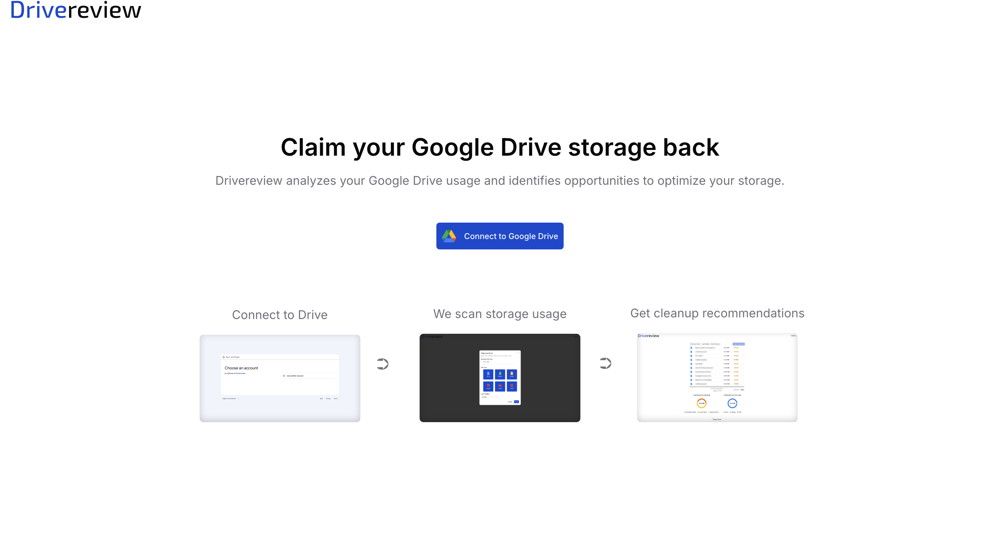
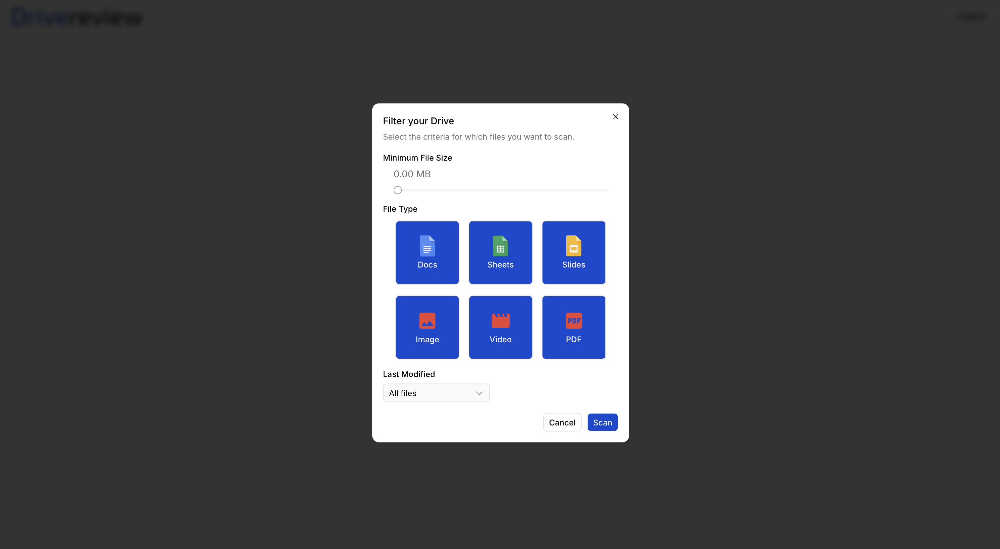
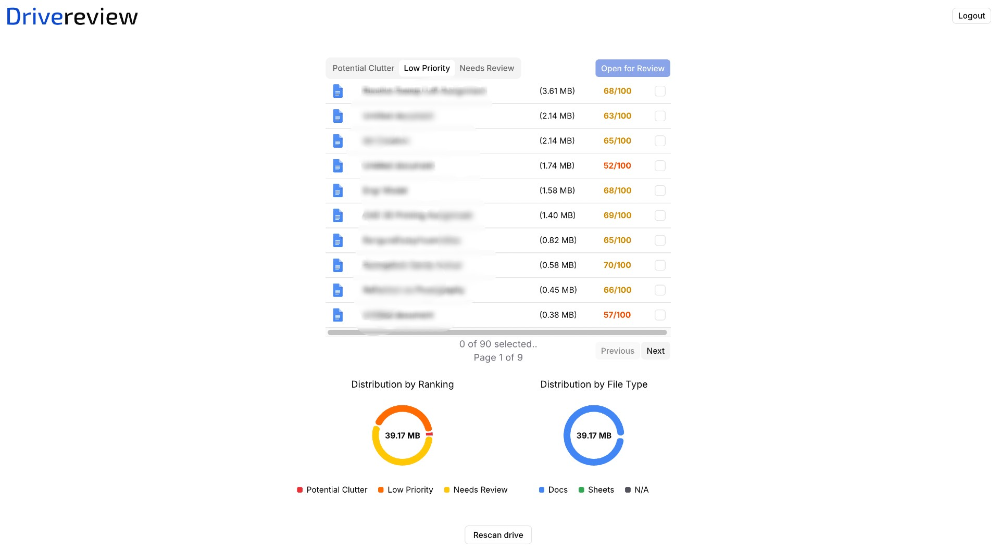

# Drivereview

Drivereview is a web application that advises users to make careful, calculated decisions on files to delete on their Google Drive.
Users while clearing out files may accidentally delete important ones, and Drivereview is built to handle that by processing and
grouping files beforehand.

## User Filtering

Users can preprocess these features for more control:

- Minimum file size (e.g. only show files larger than 1MB)
- File type (e.g. only show PDFs, or only show images)
- And last modified (e.g. only show files modified in the last year)

  

## Ranking System

Drivereview uses a ranking system to rank files based on their importance. The ranking system is based on but not limited to the following factors:

- File type
- File size
- Last modified time
- Created time
- Starred status, etc.
  

Once ranked, files are placed into one of three categories:

- Potential Clutter: Files that are likely to be unimportant and can be deleted with minimal risk.
- Low Priority: Files that may be important but are not likely to be critical. Users should review these files before deciding to delete them.
- Needs Review: Files that are likely to be important and should be reviewed carefully before deletion. These files may contain critical information or be difficult to replace if deleted.

## Review-First Approach

Drivereview encourages users to review their files before deleting them. The web application itself does not have a delete function, and instead lets users open files in Google Drive to review them before deleting. This is to prevent accidental deletion of important files and to encourage users to make informed decisions about their files.
